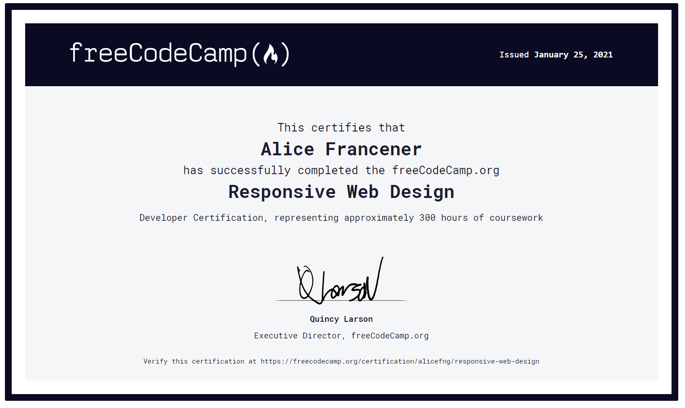

# Responsive Web Design

## :mag: Overview

This repository contains webpages built with plain HTML & CSS in order to earn a **Responsive Web Design** certification by [freeCodeCamp](https://www.freecodecamp.org/learn).

## :hammer: Projects

- [Portfolio](https://alicefrancener.github.io/responsive-web-design/portfolio/)
- Tribute Page: [CodePen](https://codepen.io/alicefrancener/pen/NWrVZZo)
- Survey Form: [Project](survey-form/) | [CodePen](https://codepen.io/alicefrancener/pen/bGwjxJW)
- Product Landing Page: [Project](product/) | [CodePen](https://codepen.io/alicefrancener/pen/NWROxMx)
- Technical Documentation Page: [Project](tech-documentation/) | [CodePen](https://codepen.io/alicefrancener/pen/VwKqLvV)
- Personal Portfolio Page: [Project](portfolio/) | [CodePen](https://codepen.io/alicefrancener/pen/VwKbozo)

## :page_with_curl: Certificate

