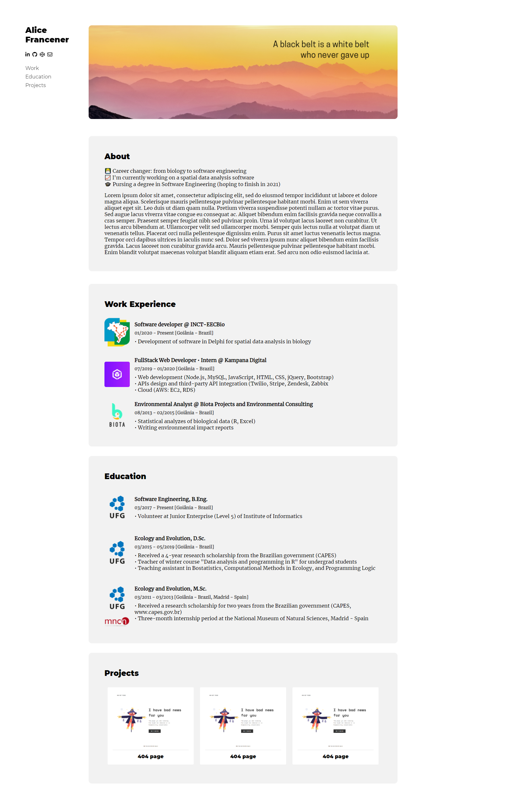

# Portfolio webpage

## Overview

- Portfolio page built with plain HTML and CSS.
- [Link to page](https://alicefrancener.github.io/responsive-web-design/portfolio/)

- Full screen

- Mobile

## User Stories

  - [x] User Story #1: My portfolio should have a welcome section with an id of welcome-section.
  - [x] User Story #2: The welcome section should have an h1 element that contains text.
  - [x] User Story #3: My portfolio should have a projects section with an id of projects.
  - [x] User Story #4: The projects section should contain at least one element with a class of project-tile to hold a project.
  - [x] User Story #5: The projects section should contain at least one link to a project.
  - [x] User Story #6: My portfolio should have a navbar with an id of navbar.
  - [x] User Story #7: The navbar should contain at least one link that I can click on to navigate to different sections of the page.
  - [x] User Story #8: My portfolio should have a link with an id of profile-link, which opens my GitHub or FCC profile in a new tab.
  - [x] User Story #9: My portfolio should have at least one media query.
  - [x] User Story #10: The height of the welcome section should be equal to the height of the viewport.
  - [x] User Story #11: The navbar should always be at the top of the viewport.

---

[Project description](https://www.freecodecamp.org/learn/responsive-web-design/responsive-web-design-projects/build-a-personal-portfolio-webpage) in freeCodeCamp
